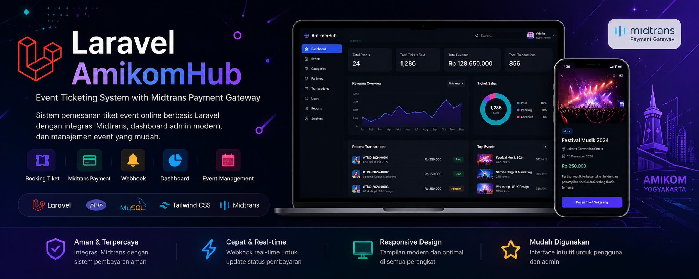

<p align="center">

</p>

<h1 align="center">🚀 Laravel AmikomHub</h1>

<h3 align="center">
Modern Event Ticketing System with Midtrans Payment Gateway
</h3>

<p align="center">


</p>

<p align="center">


</p>

<p align="center">


</p>

---

# 📖 About Project

**Laravel AmikomHub** merupakan aplikasi **Event Ticketing System** berbasis **Laravel Framework** yang dikembangkan sebagai media pembelajaran pada mata kuliah **Digital Bisnis** di **Universitas AMIKOM Yogyakarta**.

Aplikasi ini mengintegrasikan **Midtrans Payment Gateway** sebagai sistem pembayaran online, Dashboard Admin modern, manajemen event, kategori, partner, serta sistem transaksi tiket secara real-time menggunakan **Webhook Midtrans**.

---

# ✨ Features

- 🎫 Event Ticket Booking
- 💳 Midtrans Snap Payment
- 🔔 Midtrans Webhook Notification
- 📊 Admin Dashboard
- 📅 Event Management (CRUD)
- 🏷️ Category Management (CRUD)
- 🤝 Partner Management (CRUD)
- 📄 Transaction History
- 📈 Revenue Dashboard
- 👥 Customer Ticket Management
- 🔐 Authentication & Authorization
- 📱 Fully Responsive User Interface

---

# 🛠 Tech Stack

<p align="center">


</p>

| Technology   | Description         |
| ------------ | ------------------- |
| Laravel      | PHP Framework       |
| PHP          | Backend Language    |
| MySQL        | Database Management |
| Tailwind CSS | CSS Framework       |
| Midtrans     | Payment Gateway     |
| Git & GitHub | Version Control     |

---

# 📸 Screenshots

## 🏠 Home


---

## 🎫 Event Detail


---

## 💳 Checkout


---

## 📊 Dashboard Admin


---

# ⚙️ Installation

```bash
git clone https://github.com/Johansetiawan25/3258_LaravelAmikomhub.git

cd 3258_LaravelAmikomhub

composer install

cp .env.example .env

php artisan key:generate

php artisan migrate

php artisan storage:link

php artisan serve
```

---

# 📂 Project Structure

```text
app/
bootstrap/
config/
database/
public/
resources/
routes/
storage/
docs/
```

---

# 💳 Payment Gateway

✔ Midtrans Snap

✔ Midtrans Sandbox

✔ Midtrans Notification

✔ Midtrans Webhook

✔ Virtual Account

✔ QRIS

✔ GoPay

✔ ShopeePay

✔ Credit Card

---

# 👨‍💻 Developer

**Johan Setiawan**

Information Systems Student

Universitas AMIKOM Yogyakarta

GitHub

https://github.com/Johansetiawan25

---

# 📊 GitHub Statistics

<p align="center">


</p>

---

# 🔥 GitHub Streak

<p align="center">


</p>

---

# 🐍 Contribution Snake

> **Catatan:** Animasi ini akan muncul setelah GitHub Actions (`snake.yml`) berhasil dijalankan.

<p align="center">


</p>

---

<p align="center">

⭐ Don't forget to leave a star if you like this project ⭐

</p>

<p align="center">

Made with ❤️ using Laravel Framework, Tailwind CSS & Midtrans

</p>
