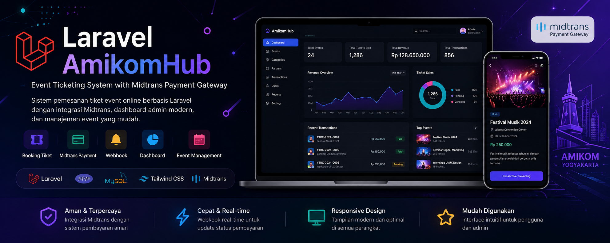
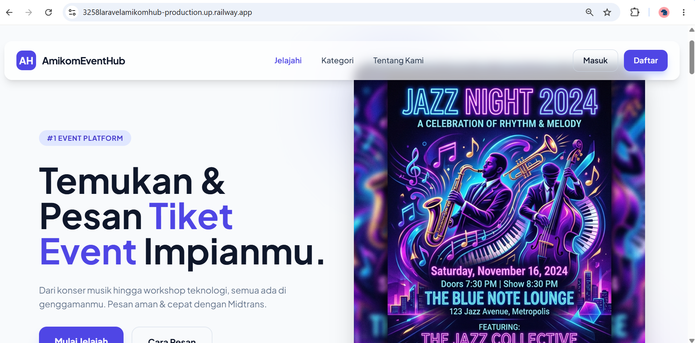
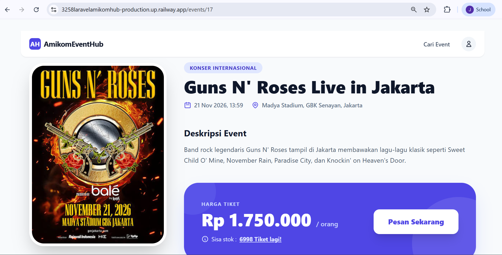
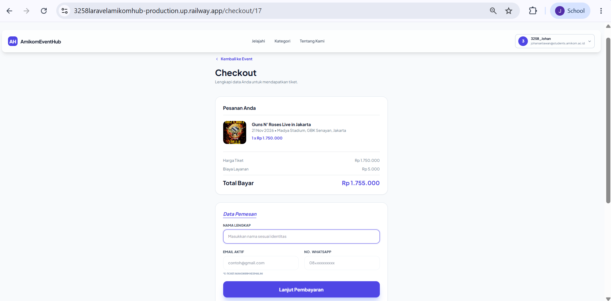
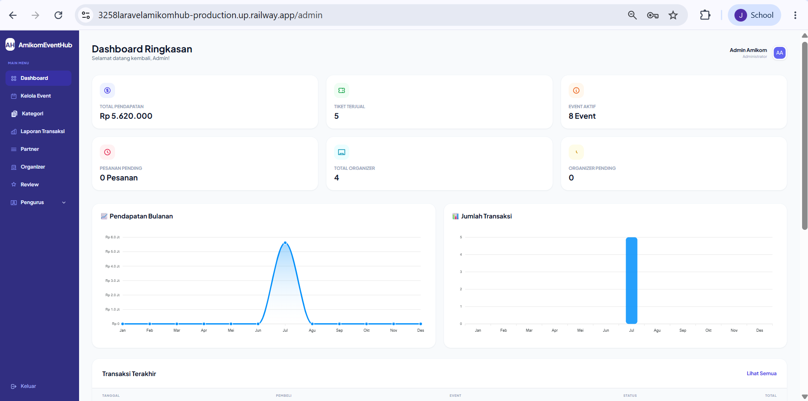
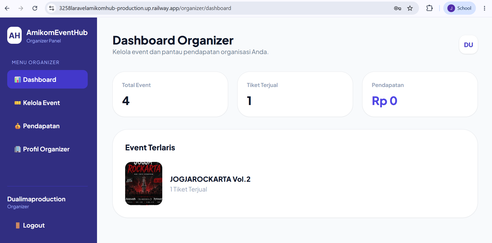

<p align="center">

</p>

<h1 align="center">🚀 Laravel AmikomHub</h1>

<h3 align="center">
Modern Multi-Tenant Event Ticketing & Management System
</h3>

<p align="center">
Platform event ticketing berbasis Laravel dengan sistem pembayaran Midtrans, Multi-Tenant Organizer, Dashboard Admin, Dashboard Organizer, dan analitik pendapatan.
</p>

<p align="center">


</p>

<p align="center">


</p>

---

# 📖 About Project

**Laravel AmikomHub** merupakan aplikasi **Event Ticketing & Management System** berbasis **Laravel 13** yang dikembangkan sebagai media pembelajaran pada mata kuliah **Digital Bisnis** di **Universitas AMIKOM Yogyakarta**.

Aplikasi ini awalnya dikembangkan sebagai sistem pemesanan tiket event dengan satu pengelola. Sistem kemudian dikembangkan menjadi platform dengan konsep **Multi-Tenant SaaS**, sehingga beberapa organisasi atau kepanitiaan seperti **HIMA, UKM, organisasi mahasiswa, maupun penyelenggara event** dapat memiliki akun dan mengelola event mereka sendiri.

Platform menyediakan tiga sisi utama:

* 👤 **Customer** — mencari event, membeli tiket, melakukan pembayaran, dan memberikan review.
* 🏢 **Organizer** — mengelola organisasi, event, transaksi, dan melihat pendapatan.
* 🛡️ **Superadmin** — mengawasi organizer, event, transaksi, serta kelayakan penyelenggara.

---

# 🌐 Live Demo

Aplikasi telah tersedia dalam versi online dan dapat digunakan untuk mencoba fitur yang telah dikembangkan.

🚀 **Production / Railway:**

**3258laravelamikomhub-production.up.railway.app**

> **Catatan:** Sistem pembayaran menggunakan **Midtrans Sandbox** untuk kebutuhan pengujian dan pembelajaran.

---

# 🔐 Demo Account

Gunakan akun demo berikut untuk mencoba fitur berdasarkan role pengguna.

### 👤 Customer

```text
Email    : 
Password : 

bisa login pakai google
```

### 🏢 Organizer

```text
Email    : Johan@gmail.com
Password : Johan123
```

### 🛡️ Superadmin

```text
Email    : admin@amikom.ac.id
Password : password
```

> **Catatan:** Ganti seluruh data `YOUR_...` dengan akun demo yang benar sebelum README dipublikasikan.

---

# ✨ Main Features

## 🎫 Customer

* 🔎 Menjelajahi event
* 📅 Melihat detail event
* 🏢 Melihat profil organizer
* 🎟️ Pemesanan tiket
* 💳 Pembayaran melalui Midtrans
* 🔔 Konfirmasi pembayaran melalui Webhook
* 🎫 Melihat tiket yang telah dibeli
* 📜 Melihat detail transaksi
* ⭐ Memberikan rating dan review kepada organizer
* 👤 Authentication pengguna

---

## 🏢 Organizer

Organizer merupakan **tenant** dalam sistem Multi-Tenant.

Setiap organizer memiliki akun dan dashboard sendiri untuk mengelola aktivitas organisasinya.

### Fitur Organizer:

* 📝 Registrasi akun organizer
* 🔐 Login organizer
* 🚪 Logout organizer
* 📊 Dashboard organizer
* 📅 CRUD Event
* 🎫 Mengelola event milik sendiri
* 📦 Mengelola stok tiket
* 💰 Melihat pendapatan
* 📈 Melihat analitik transaksi
* 🧾 Melihat transaksi event
* 🏢 Mengelola informasi organizer
* ⭐ Melihat rating dan review
* 🖼️ Mengelola logo organizer
* ⏳ Status kelayakan organizer

Setiap organizer hanya dapat mengelola data yang menjadi miliknya.

---

# 🏢 Multi-Tenant Architecture

Salah satu pengembangan utama pada project ini adalah perubahan arsitektur dari sistem satu pengelola menjadi **Multi-Tenant Platform**.

```text
                    Laravel AmikomHub
                           │
            ┌──────────────┴──────────────┐
            │                             │
       Superadmin                    Customer
            │                             │
            │                        Browse Event
            │                        Buy Ticket
            │                        Payment
            │                        Review
            │
       Manage Organizer
            │
      ┌─────┴─────┐
      │           │
 Organizer A   Organizer B
      │           │
      ▼           ▼
   Events       Events
   Revenue      Revenue
   Analytics    Analytics
```

Setiap organizer mempunyai ruang pengelolaan sendiri.

Contoh:

```text
Organizer A
├── Event A1
├── Event A2
├── Transaction
└── Revenue

Organizer B
├── Event B1
├── Event B2
├── Transaction
└── Revenue
```

Data Organizer A tidak bercampur dengan data Organizer B.

---

# 🛡️ Superadmin

Superadmin berfungsi sebagai pengawas utama platform.

### Fitur Superadmin:

* 📊 Dashboard Admin
* 👥 Manajemen Organizer
* ✅ Approve Organizer
* ⏳ Melihat Organizer Pending
* ❌ Reject Organizer
* 📅 Manajemen Event
* 🏷️ Manajemen Kategori
* 🤝 Manajemen Partner
* 🧾 Manajemen Transaksi
* ⭐ Manajemen Review
* 📈 Monitoring pendapatan
* 👀 Monitoring seluruh penyelenggara

Superadmin dapat mengawasi seluruh organizer yang terdaftar pada platform.

---

# 💰 Revenue & Analytics

Dashboard Organizer menyediakan informasi pendapatan berdasarkan transaksi event yang dimiliki organizer.

Informasi yang tersedia meliputi:

* 💰 Total Pendapatan
* 🎫 Total Tiket Terjual
* 🧾 Total Transaksi
* 📅 Total Event
* 📊 Performa Penjualan
* 📈 Analitik Pendapatan

Alur pendapatan:

```text
Customer
   │
   ▼
Checkout Event
   │
   ▼
Midtrans Payment
   │
   ▼
Payment Success
   │
   ▼
Transaction
   │
   ▼
Organizer Revenue
```

Pendapatan organizer dihitung berdasarkan transaksi event yang terkait dengan organizer tersebut.

---

# 💳 Payment Gateway

Project menggunakan **Midtrans Snap** sebagai payment gateway.

### Payment Features

* ✔ Midtrans Snap
* ✔ Midtrans Sandbox
* ✔ Payment Notification
* ✔ Midtrans Webhook
* ✔ Virtual Account
* ✔ QRIS
* ✔ GoPay
* ✔ ShopeePay
* ✔ Credit Card

Alur pembayaran:

```text
Customer
   │
   ▼
Checkout
   │
   ▼
Midtrans Snap
   │
   ▼
Payment
   │
   ▼
Midtrans Webhook
   │
   ▼
Update Transaction
   │
   ▼
Ticket Activated
```

---

# ⭐ Rating & Review System

Customer dapat memberikan review setelah melakukan pembelian tiket.

```text
Customer membeli tiket
        │
        ▼
Pembayaran berhasil
        │
        ▼
Tiket tersedia
        │
        ▼
Customer memberikan review
        │
        ▼
Rating Organizer
        │
        ▼
Review tampil di profil Organizer
```

Rating dan review dapat digunakan sebagai indikator kualitas organizer.

---

# 🔐 Authentication & Authorization

Sistem memiliki beberapa level akses:

| Role           | Akses                                    |
| -------------- | ---------------------------------------- |
| 👤 Customer    | Event, Checkout, Tiket, Review           |
| 🏢 Organizer   | Dashboard, Event, Transaksi, Pendapatan  |
| 🛡️ Superadmin | Monitoring & Management seluruh platform |

Authentication organizer dipisahkan dari authentication customer dan superadmin.

---

# 📊 Dashboard

## 🛡️ Superadmin Dashboard

Menampilkan informasi keseluruhan platform:

* Total Event
* Total Organizer
* Total Customer
* Total Transaksi
* Total Pendapatan
* Organizer Pending
* Monitoring Event

---

## 🏢 Organizer Dashboard

Setiap organizer mempunyai dashboard masing-masing.

Dashboard menampilkan:

* Total Event
* Total Transaksi
* Tiket Terjual
* Pendapatan
* Analitik Event
* Rating Organizer

```text
Organizer Dashboard

┌─────────────────────────────────────────┐
│ Total Event       │ Total Transaksi    │
├─────────────────────────────────────────┤
│ Tiket Terjual     │ Pendapatan         │
├─────────────────────────────────────────┤
│                                         │
│        Revenue Analytics                │
│                                         │
└─────────────────────────────────────────┘
```

---

# 📅 Event Management

Organizer dapat mengelola event mereka sendiri melalui dashboard.

Fitur:

* ➕ Tambah Event
* ✏️ Edit Event
* 🗑️ Hapus Event
* 🖼️ Upload Poster
* 🏷️ Pilih Kategori
* 📍 Lokasi Event
* 📅 Tanggal Event
* 💰 Harga Tiket
* 🎟️ Stok Tiket

Setiap event terhubung dengan organizer yang membuatnya.

---

# 🛠 Tech Stack

| Technology   | Description       |
| ------------ | ----------------- |
| Laravel 13   | Backend Framework |
| PHP 8.3+     | Backend Language  |
| MySQL        | Database          |
| Tailwind CSS | Frontend UI       |
| Blade        | Template Engine   |
| Midtrans     | Payment Gateway   |
| Git          | Version Control   |
| GitHub       | Repository        |
| Laragon      | Local Development |

---

# 📂 Project Structure

```text
app/
├── Http/
│   ├── Controllers/
│   │   ├── Admin/
│   │   └── Organizer/
│   │
│   └── Middleware/
│
├── Models/
│
bootstrap/
│
config/
│
database/
├── migrations/
└── seeders/
│
public/
│
resources/
├── views/
│   ├── admin/
│   ├── organizer/
│   ├── layouts/
│   └── ...
│
routes/
└── web.php

storage/
docs/
```

---

# 🗄️ Database Relationship

Relasi utama sistem:

```text
User
 │
 ├── Transactions
 └── Reviews

Organizer
 │
 ├── Events
 └── Reviews

Event
 │
 ├── Organizer
 ├── Category
 └── Transactions

Transaction
 │
 ├── User
 └── Event

Review
 │
 ├── User
 └── Organizer
```

---

# 📸 Screenshots

## 🏠 Home



---

## 🎫 Event Detail



---

## 💳 Checkout



---

## 🛡️ Superadmin Dashboard



---

## 🏢 Organizer Dashboard



---

# ⚙️ Installation

Clone repository:

```bash
git clone https://github.com/Johansetiawan25/3258_LaravelAmikomhub.git
```

Masuk ke project:

```bash
cd 3258_LaravelAmikomhub
```

Install dependency:

```bash
composer install
```

Buat file environment:

```bash
cp .env.example .env
```

Generate application key:

```bash
php artisan key:generate
```

Konfigurasi database pada `.env`:

```env
DB_DATABASE=eventtiket_db
DB_USERNAME=root
DB_PASSWORD=
```

Jalankan migration:

```bash
php artisan migrate
```

Jika menggunakan seeder:

```bash
php artisan db:seed
```

Buat symbolic link storage:

```bash
php artisan storage:link
```

Jalankan server:

```bash
php artisan serve
```

Aplikasi dapat diakses melalui:

```text
http://127.0.0.1:8000
```

---

# 🔑 Authentication Flow

## 👤 Customer

```text
Home
 │
 ▼
Login / Register
 │
 ▼
Browse Event
 │
 ▼
Checkout
 │
 ▼
Payment
 │
 ▼
My Ticket
```

## 🏢 Organizer

```text
Organizer Register
 │
 ▼
Approval Superadmin
 │
 ▼
Organizer Login
 │
 ▼
Organizer Dashboard
 │
 ├── Event
 ├── Transaction
 ├── Revenue
 └── Analytics
```

## 🛡️ Superadmin

```text
Admin Login
 │
 ▼
Admin Dashboard
 │
 ├── Organizer
 ├── Event
 ├── Category
 ├── Partner
 ├── Transaction
 └── Review
```

---

# 🔒 Security & Access Control

Platform menerapkan pembatasan akses berdasarkan role dan middleware.

```text
/customer
    ↓
Customer Authentication

/organizer/*
    ↓
Organizer Middleware

/admin/*
    ↓
Auth + Admin Middleware
```

Organizer tidak dapat mengakses dashboard organizer lain.

Superadmin memiliki akses monitoring terhadap seluruh organizer yang terdaftar.

---

# 🎓 Academic Project

Project ini dikembangkan untuk memenuhi kebutuhan pembelajaran dan tugas pada:

**Mata Kuliah:** Digital Bisnis
**Universitas:** Universitas AMIKOM Yogyakarta
**Framework:** Laravel 13

Pengembangan project mencakup:

* MVC Architecture
* CRUD
* Authentication
* Authorization
* Payment Gateway
* Webhook
* Multi-Tenant Architecture
* Dashboard Analytics
* Database Relationship
* Role-Based Access Control

---

# 👨‍💻 Developer

**Johan Setiawan**

Information Systems Student
Universitas AMIKOM Yogyakarta

GitHub:

https://github.com/Johansetiawan25

---

# 📊 GitHub Statistics

<p align="center">


</p>

---

# 🔥 GitHub Streak

<p align="center">


</p>

---

# 🐍 Contribution Snake

> Animasi contribution akan muncul setelah GitHub Actions `snake.yml` berhasil dijalankan.

<p align="center">


</p>

---

# 🚀 Future Development

Beberapa pengembangan yang dapat dilakukan selanjutnya:

* 📱 Mobile Application
* 📊 Advanced Organizer Analytics
* 📈 Revenue Chart berdasarkan periode
* 💰 Automatic Revenue Settlement
* 📧 Email Notification
* 🔔 Real-time Notification
* 🎟️ QR Code Ticket Validation
* 📍 Event Location Integration
* ☁️ Cloud Deployment
* 🔐 Two-Factor Authentication

---

<p align="center">

⭐ <strong>Don't forget to leave a star if you like this project!</strong> ⭐

</p>

<p align="center">

Made with ❤️ using Laravel 13, Tailwind CSS & Midtrans

</p>
